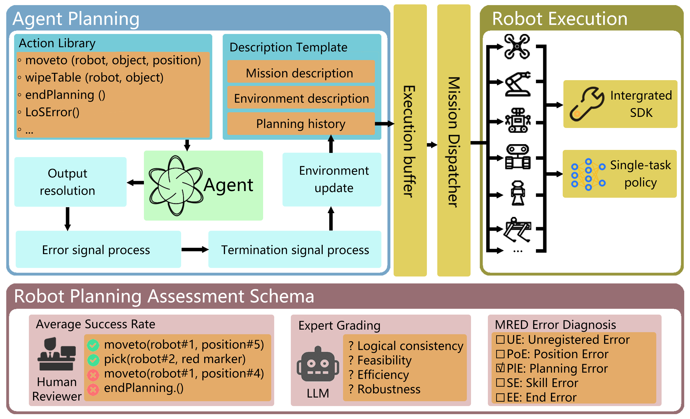

# EmbodiedAgent
Code and dataset release for paper: *EmbodiedAgent: A Scalable Hierarchical Approach to Overcome Practical Challenge in Multi-Robot Control*




# Usage

Arrange your folder as:

```shell
├─EmbodiedAgent
│  ├─model
│      ├─local LLMs
│  ├─resources
│      ├─system_prompt.txt
│      ├─test_MultiPlan+.jsonl
│      └─skill.jsonl
│  └─src
│      ├─agent
│      └─utils
```


Create conda environment named `EmbodiedAgent` and activate.

```cmd
cd ./EmbodiedAgent
conda activate EmbodiedAgent
```


Run with online LLM service:

```cmd
python main.py --model_name=deepseek-reasoner --api_key=your_api_key  --base_url=https://api.deepseek.com --resource_path=./resource
```


Run with local LLMs:

```cmd
python main.py --model_name=LLaMA-3.1-8B-Multiplan_Plus_NAP --local_model_path=./model --resource_path=./resource
```


# Links

Code: [EmbodiedAgent](https://github.com/HaronW/EmbodiedAgent)

Dataset: [MultiPlan+](https://github.com/HaronW/MultiPlan_plus)

Model weight: [EmbodiedAgent](https://huggingface.co/HaronW/EmbodiedAgent)


# License

EmbodiedAgent is released under the MIT License. See the LICENSE file for more details.
